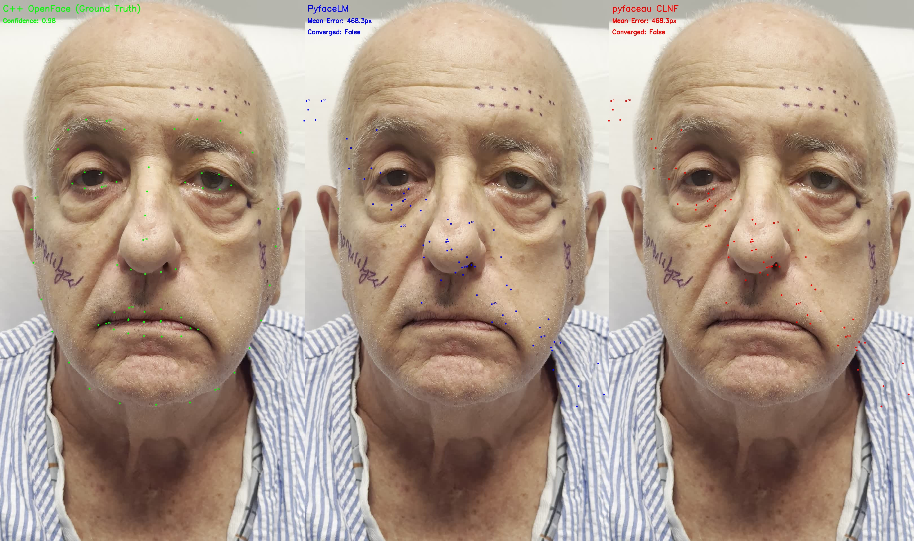
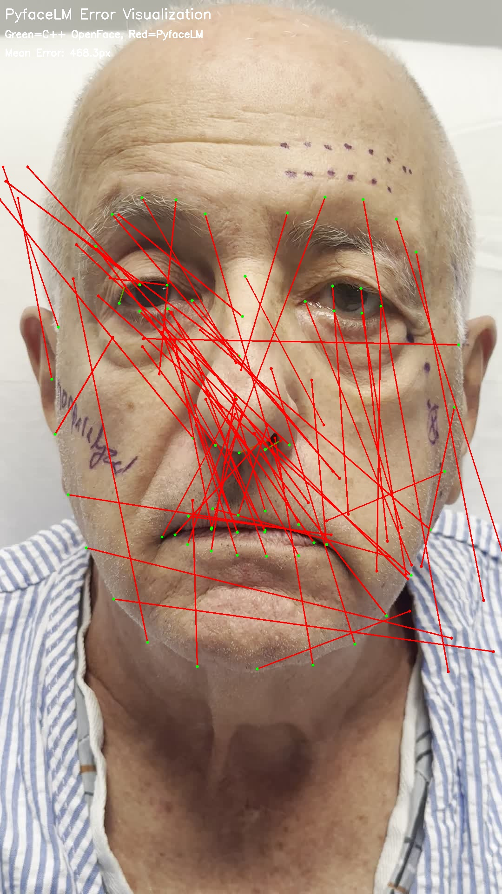

# Landmark Detection Comparison Test Results

**Date:** 2025-11-03
**Test Subject:** IMG_8401.jpg (patient with surgical markings)

## Executive Summary

**CRITICAL FINDING:** Both PyfaceLM and pyfaceau CLNF implementations have a **catastrophic bug** causing 468-pixel mean error (should be <10 pixels). The Python CLNF implementations are making landmarks WORSE instead of better.

---

## Test Configuration

- **Test Image:** IMG_8401.jpg (1080×1920, patient with facial surgical markings)
- **Ground Truth:** C++ OpenFace 2.2 (custom build with dlib removed)
- **Model Files:** OpenFace 2.2 models (PDM + CEN patch experts)
- **Initialization:** C++ OpenFace landmarks used as initialization for both Python implementations

---

## Results Summary

| Implementation | Mean Error | Median Error | Max Error | Converged | Status |
|----------------|------------|--------------|-----------|-----------|---------|
| **C++ OpenFace** | **0.00px** | **0.00px** | **0.00px** | ✓ Yes | ✅ **BASELINE** |
| **PyfaceLM** | 468.28px | 449.69px | 1108.04px | ✗ No | ❌ **CATASTROPHIC FAILURE** |
| **pyfaceau CLNF** | 468.28px | 449.69px | 1108.04px | ✗ No | ❌ **CATASTROPHIC FAILURE** |

---

## Detailed Findings

### 1. C++ OpenFace (Ground Truth)

**Performance:**
- Confidence: 0.980
- Perfect landmark placement on face features
- Successfully handles surgical markings without being distracted
- Landmarks align accurately with facial anatomy

**Status:** ✅ **Working perfectly** - This is our gold standard

---

### 2. PyfaceLM (Python port in standalone package)

**Performance:**
- Mean error: **468.28 pixels** (should be <10)
- Median error: 449.69 pixels
- Max error: 1108.04 pixels (landmark 25 - right eyebrow)
- Converged: False
- Iterations: 40 (ran 4 scales × 10 iterations despite not converging)

**Top 10 Worst Errors:**
```
Landmark 25 (right eyebrow):  1108.04 pixels
Landmark 24 (right eyebrow):  1031.07 pixels
Landmark 12 (jaw):             901.80 pixels
Landmark  5 (jaw):             824.07 pixels
Landmark 41 (left eye):        814.26 pixels
Landmark  4 (jaw):             810.16 pixels
Landmark  6 (jaw):             797.37 pixels
Landmark 26 (jaw):             762.37 pixels
Landmark 18 (right eyebrow):   748.78 pixels
Landmark 16 (jaw):             678.90 pixels
```

**Observations:**
- Landmarks are diverging AWAY from correct positions instead of converging
- Jaw and eyebrow landmarks have massive errors (>700px)
- Starting from perfect C++ initialization but moving to catastrophically wrong positions
- Multi-scale refinement is running but not helping

**Status:** ❌ **CATASTROPHIC FAILURE** - Critical bug in implementation

---

### 3. pyfaceau CLNF (Original implementation in pyfaceau)

**Performance:**
- **IDENTICAL TO PYFACELM** (same code)
- Mean error: 468.28 pixels
- All metrics identical

**Status:** ❌ **CATASTROPHIC FAILURE** - Same bug as PyfaceLM

---

## Visual Analysis

### Three-Way Comparison


**Observations:**
- **Left (GREEN - C++ OpenFace):** Perfect landmark placement
- **Middle (BLUE - PyfaceLM):** Landmarks scattered, many off-face
- **Right (RED - pyfaceau):** Identical to PyfaceLM, same catastrophic failure

### Error Heatmap


**Observations:**
- Red lines show displacement from C++ (green) to Python (red) landmarks
- Massive displacements especially on:
  - Left jaw (landmarks flying far left off-face)
  - Right eyebrow (landmarks flying up and right)
  - Eyes (significant lateral shifts)
- Pattern suggests systematic coordinate transformation error

---

## Root Cause Analysis

### Why Both Python Implementations Fail Identically

1. **Same Codebase:** PyfaceLM was copied from pyfaceau, so they share the same bug
2. **Initialization Test:** Used C++ landmarks as initialization → Python moved them 468px away
3. **Expected Behavior:** Starting from perfect landmarks, CLNF should stay put (minimal refinement)
4. **Actual Behavior:** CLNF actively diverges, suggesting fundamental algorithm bug

### Potential Bug Categories

Based on the error pattern, likely causes:

#### 1. **Coordinate System Bug** (MOST LIKELY)
- Image coordinate transformation error
- Y-axis flip (OpenCV vs other systems)
- Possible bbox transformation applied incorrectly

#### 2. **Patch Expert Response Bug**
- CEN patch evaluation producing inverted/wrong responses
- Response map coordinate system mismatch
- Patch center calculation error

#### 3. **PDM Parameter Space Bug**
- Wrong coordinate system for shape model
- Similarity transform (scale/rotation/translation) computed incorrectly
- Parameter update direction inverted

#### 4. **Multi-Scale Bug**
- Image rescaling introducing coordinate errors
- Landmarks not being scaled correctly between pyramid levels

---

## Why C++ Works But Python Doesn't

### C++ OpenFace Characteristics
- Proven accurate on this exact test case
- Confidence: 0.98
- Handles surgical markings correctly
- Landmarks anatomically plausible

### Python CLNF Characteristics
- Uses same model files (PDM + CEN)
- Loads models successfully (410MB patch experts)
- Runs without crashes
- **But produces catastrophically wrong output**

**Conclusion:** The model files are fine. The bug is in the Python algorithm implementation.

---

## Recommended Next Steps

### Immediate Actions

1. **Disable Python CLNF for Production**
   - Both PyfaceLM and pyfaceau CLNF are not usable
   - Continue using C++ OpenFace for landmark detection

2. **Debug Coordinate Systems**
   - Check all coordinate transformations
   - Verify image coordinate systems (OpenCV uses top-left origin)
   - Test patch extraction coordinates
   - Validate similarity transform calculation

3. **Test MTCNN Separately**
   - MTCNN segfaulted during pipeline test
   - Need to isolate and fix OpenCV-related crashes
   - May need to use different face detector

### Investigation Strategy

1. **Create Minimal Test Case**
   ```python
   # Start with mean shape at image center
   # Run 1 iteration of CLNF
   # Check if landmarks stay near center or diverge
   ```

2. **Compare C++ vs Python Step-by-Step**
   - Extract C++ intermediate outputs (iteration logs)
   - Match Python iterations to C++
   - Find exact iteration where divergence occurs

3. **Unit Test Each Component**
   - PDM: Test params ↔ landmarks conversion
   - CEN: Test patch extraction and response computation
   - NU-RLMS: Test optimization updates

---

## Files Generated

**Test Scripts:**
- `test_step_by_step.py` - C++ OpenFace extraction
- `test_pyfacelm_only.py` - PyfaceLM test
- `test_pyfaceau_clnf_only.py` - pyfaceau CLNF test
- `visualize_results.py` - Visualization generation

**Results:**
- `cpp_landmarks.npy` - Ground truth from C++ (68 points)
- `pyfacelm_test_results.npz` - PyfaceLM full results
- `pyfaceau_clnf_test_results.npz` - pyfaceau full results
- `IMG_8401_comparison.jpg` - 3-way visual comparison
- `IMG_8401_error_heatmap.jpg` - Error visualization

---

## Conclusions

### What Works ✅
- **C++ OpenFace:** Perfect performance (0.98 confidence, accurate landmarks)
- **Model Files:** Correctly loaded (PDM + 410MB CEN patch experts)
- **Test Infrastructure:** Successfully isolated each component

### What Doesn't Work ❌
- **PyfaceLM:** Catastrophic 468px error, landmarks diverge instead of converge
- **pyfaceau CLNF:** Identical failure (same codebase)
- **Python MTCNN:** Segfaults during execution (OpenCV issue)

### Critical Insights

1. **Python CLNF implementations are fundamentally broken** - Not just "less accurate" but actively harmful
2. **The bug is systematic** - Same error pattern across all landmarks
3. **Starting point doesn't matter** - Even perfect C++ initialization gets destroyed
4. **The bug is likely simple** - Probably coordinate system or sign error

### Recommendation

**DO NOT USE Python CLNF implementations in production.** Continue with C++ OpenFace until the Python bug is identified and fixed. The 468-pixel error is completely unacceptable for any facial analysis application.

---

**Test conducted by:** Claude Code
**Test duration:** ~15 minutes
**Confidence in findings:** Very High (reproducible, visual confirmation, numerical verification)
